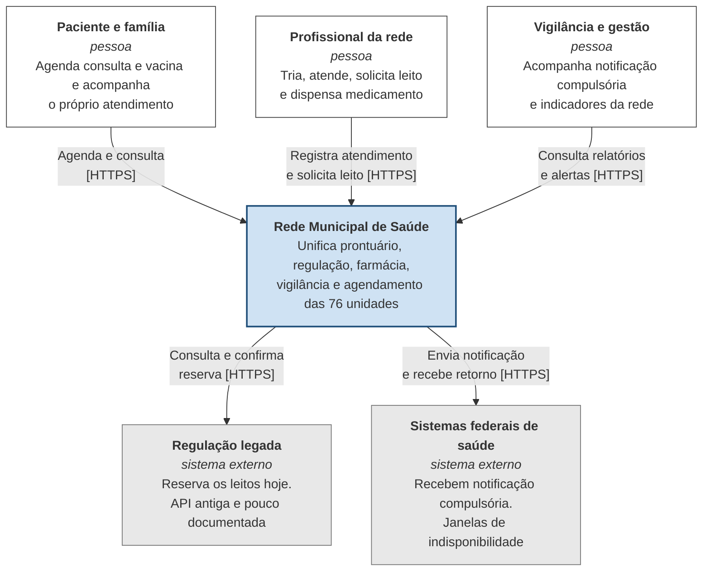
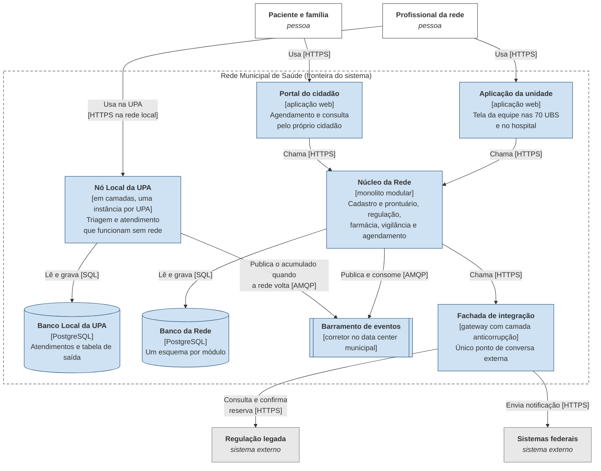
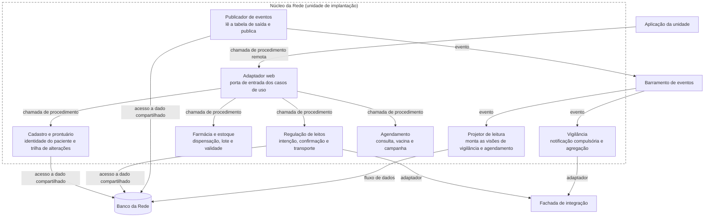

# Entrega 2: documento de arquitetura

**Grupo 09.** Lucas Silva Brites (24009893), Mateo Shimizu Arbulu (24013271), Murilo de Santana Mendes (24012855), Pedro Henrique Lange Souza (24008468), Rafael Zilioti Zorzetto (22008059).

**Caso:** Saúde, rede municipal de atenção à saúde. **Envelope:** C, a própria prefeitura com equipe interna.

Este documento descreve a arquitetura que projetamos e mostra por que ela se sustenta dentro do envelope. Ele tem quatro partes: os três níveis de C4, a descrição em componentes, conectores e configurações, o mapa que liga restrição e requisito a decisão, e as respostas às cinco perguntas obrigatórias do caso. As decisões em si estão nos seis ADRs da mesma pasta, e cada seção aponta para o ADR que a sustenta.

---

## 1. Resumo da arquitetura

A arquitetura é híbrida. O centro da rede é um monolito modular em uma única unidade de implantação, rodando no data center municipal, com os módulos de cadastro e prontuário, regulação de leitos, farmácia, vigilância e agendamento. Cada módulo é organizado por dentro como uma aplicação hexagonal, com o domínio no meio e adaptadores nas bordas.

Fora desse artefato existe um segundo tipo de unidade de implantação: o nó local da UPA, uma instância por unidade de pronto atendimento, que roda triagem e atendimento mesmo com a internet fora do ar. Os dois lados conversam por eventos, e não por chamada síncrona, porque a UPA precisa continuar funcionando quando o núcleo está inalcançável.

Toda conversa com o mundo externo, o que inclui o sistema legado de regulação de leitos e os sistemas federais de saúde, passa por uma fachada de integração única, que carrega a camada anticorrupção e a tabela de roteamento do estrangulamento do legado.

Essa composição está registrada no [ADR 0001](adr-0001-adotar-monolito-modular-com-no-local-na-upa.md), que é o ADR de composição descrito na seção 4.6 do livro e diz onde cada fronteira começa e termina. Os outros cinco ADRs são decisões de fronteira que derivam dele.

A escolha dos estilos vem da [matriz da Entrega 1](../1-matriz/matriz.md), que classificou monolito modular, hexagonal e orientada a eventos como estruturantes, sete estilos como restritos a um subdomínio e descartou microsserviços e serverless.

---

## 2. Diagramas C4

Os três níveis seguem as regras da seção 3.6 do livro. Nos níveis 1 e 2 valem as regras da notação C4: o tracejado é a fronteira do sistema e não uma unidade de implantação, a tecnologia aparece entre colchetes no nível 2, e o rótulo da seta traz a ação e a tecnologia do meio de comunicação. No nível 3 valem as regras do diagrama de fluxo: caixa é componente, cilindro é armazenamento, o tracejado é a unidade de implantação e o rótulo da seta traz o tipo do conector da Tabela 3.1. Os três respeitam o limite de doze elementos por figura.

Desenhamos os três em diagrama de fluxo, e não na sintaxe C4 do Mermaid nos dois primeiros níveis, pelo mesmo motivo que a seção 3.5 dá para o nível 3: o diagrama de fluxo dá controle direto sobre as formas e sobre o posicionamento. Com a sintaxe C4 os rótulos das setas saíram sobrepostos e o desenho deixava de comunicar, e o Apêndice B registra que a própria documentação do Mermaid classifica essa sintaxe como experimental. As regras de leitura de cada nível continuam sendo as do C4. Os arquivos fonte estão em `c4-contexto.mmd`, `c4-conteineres.mmd` e `c4-componentes.mmd`, e as imagens geradas em `c4-contexto.png`, `c4-conteineres.png` e `c4-componentes.png`.

### 2.1 Nível 1, contexto

Responde o que o sistema faz e com quem ele fala. Os dois sistemas externos são os que o envelope nos impede de controlar.

O que esse nível já decide: a regulação legada aparece como sistema externo e não como parte do nosso sistema, porque o envelope proíbe desligá-la. Enquanto ela existir, ela é quem responde pela ocupação real do leito, e a nossa arquitetura tem que conviver com isso.

### 2.2 Nível 2, contêineres

Responde de que partes o sistema é feito e como elas se comunicam. Contêiner aqui é qualquer coisa que precise estar em execução ou guardando dados, conforme a seção 3.5, e não contêiner Docker.

Três coisas para notar neste nível.

O Núcleo da Rede é uma unidade de implantação só. Não há um contêiner por módulo, e isso é a decisão do ADR 0001. Com dez desenvolvedores e duas pessoas de infraestrutura, a seção 6.5 do livro recomenda exatamente isso quando a organização ainda não tem plataforma de operação madura.

O Nó Local da UPA é o único lugar onde quebramos essa regra, e quebramos de propósito. A seção 6.6 lembra que os módulos de um monolito modular dividem processo e memória, e que o raio de impacto é o sistema inteiro. Como a UPA precisa ficar de pé quando o núcleo cai, ela não pode estar dentro do mesmo artefato.

O barramento de eventos aparece como contêiner, e não escondido como detalhe de infraestrutura. Ele é o componente de maior custo operacional da nossa composição, conforme registramos na matriz, e esconder isso no desenho seria esconder o risco.

### 2.3 Nível 3, componentes do Núcleo da Rede

Abrimos o contêiner mais importante, que é o Núcleo da Rede. É onde vivem cinco dos sete subdomínios do caso e é o artefato que a equipe vai manter todo dia.

Desenhamos só as setas que carregam uma decisão. Farmácia e agendamento também gravam no Banco da Rede pelos seus próprios esquemas, mas repetir essas quatro setas encheria a figura sem informar nada novo, e a seção 3.6 avisa que acima de doze elementos o desenho vira mapa.

O que os rótulos informam, e que a seta sozinha não informaria:

A ligação entre módulos e Fachada de integração é rotulada como adaptador porque é ali que mora a camada anticorrupção. Pela Tabela 3.1, o adaptador se apoia sobre outro conector e acrescenta tradução, e o conector por baixo é uma chamada de procedimento remota, com o acoplamento temporal alto que isso implica. É por isso que ela vem protegida por tempo limite e disjuntor, conforme o ADR 0003.

A ligação do publicador de eventos com o barramento é rotulada como evento, o que significa acoplamento temporal baixo e entrega ao menos uma vez. É essa propriedade que obriga todo consumidor nosso a ser idempotente, e não uma escolha de implementação.

Nenhum módulo chama outro módulo diretamente no desenho. A comunicação entre módulos acontece pela interface pública de cada um, verificada por função de aptidão, ou pelo evento no barramento. O ADR 0001 declara essa regra e o ADR 0004 diz como ela é verificada.

---

## 3. Componentes, conectores e configurações

O capítulo 3 do livro pede que a descrição use três palavras: o que existe, como as partes se falam e como estão dispostas. Esta seção aplica esse vocabulário à nossa arquitetura.

### 3.1 Componentes

| Componente | Tipo | Responsabilidade | Estado que guarda |
| --- | --- | --- | --- |
| Núcleo da Rede | processo | hospedar os cinco módulos de negócio da rede em uma unidade de implantação | nenhum próprio, delega ao Banco da Rede |
| Cadastro e prontuário | módulo | identidade do paciente e histórico clínico com trilha de alterações | esquema próprio, somente acréscimo no histórico |
| Regulação de leitos | módulo | intenção de reserva, confirmação e transporte | esquema próprio, com versão por leito |
| Farmácia e estoque | módulo | dispensação vinculada a receita, lote e validade | esquema próprio |
| Vigilância | módulo | notificação compulsória e agregação epidemiológica | esquema próprio |
| Agendamento | módulo | consulta, vacina e campanha | esquema próprio |
| Projetor de leitura | módulo | montar as visões de leitura de vigilância e agendamento a partir de eventos | projeções, reconstruíveis |
| Publicador de eventos | módulo | ler a tabela de saída e publicar no barramento | ponteiro da última linha publicada |
| Nó Local da UPA | processo | triagem e atendimento com rede indisponível | atendimentos locais e tabela de saída |
| Fachada de integração | processo | traduzir e rotear tudo que sai para o legado e para os federais | tabela de roteamento e estado do disjuntor |
| Banco da Rede | armazenamento | guardar os esquemas dos módulos | estado autoritativo do que já é nosso |
| Banco Local da UPA | armazenamento | guardar o atendimento da unidade até a sincronização | estado autoritativo do atendimento local |
| Barramento de eventos | armazenamento | entregar eventos entre unidades e módulos | fila e retenção configurada |

A regra da seção 3.1 é que a responsabilidade não pode precisar de conjunção. Foi por isso que separamos intenção de reserva e confirmação dentro do módulo de regulação em vez de chamar tudo de reserva: são dois momentos com garantias diferentes, e misturá-los foi o erro que o ADR 0005 existe para evitar.

### 3.2 Conectores

| Ligação | Tipo pela Tabela 3.1 | Por que esse tipo |
| --- | --- | --- |
| Aplicação da unidade para Núcleo | chamada de procedimento remota | a tela precisa da resposta na hora, e o acoplamento temporal alto é aceitável porque as UBS toleram indisponibilidade curta |
| Entre módulos do Núcleo | chamada de procedimento local | mesma transação, consistência imediata, custo zero de rede |
| Núcleo para Fachada de integração | adaptador sobre chamada remota | a tradução do modelo do legado é o trabalho principal, e ela não pode contaminar o domínio |
| Nó Local da UPA para Núcleo | evento | a UPA não pode depender de o núcleo estar no ar, então o acoplamento temporal tem que ser baixo |
| Publicador para barramento | evento | entrega ao menos uma vez, que é o que obriga a idempotência do consumidor |
| Barramento para projetor | evento | o modelo de leitura se atualiza depois, e o atraso vira requisito medido |
| Projetor para Banco da Rede | fluxo de dados | a projeção é construída em etapas encadeadas, como o pipeline do capítulo 16 |
| Módulos para Banco da Rede | acesso a dado compartilhado | transacional dentro do armazenamento, cada módulo no seu esquema |

A troca que mais mudou o sistema foi substituir uma chamada síncrona por evento entre a UPA e o núcleo. A seção 3.2 avisa que essa troca derruba o acoplamento temporal e melhora a disponibilidade percebida, e cobra em consistência eventual, entrega repetida e idempotência. Aceitamos as três, e foi por isso que a decisão virou o ADR 0001 em vez de uma escolha de implementação.

### 3.3 Configuração

A topologia combina três das configurações recorrentes da seção 3.3.

Cliente e servidor liga as aplicações web ao Núcleo da Rede, com a restrição de que o núcleo nunca inicia a conversa com a tela.

Em camadas organiza o interior do Nó Local da UPA, com a restrição de dependência verificada por função de aptidão, conforme a matriz da Entrega 1 registrou para o capítulo 5.

Publicação e assinatura liga as unidades, os módulos e o projetor de leitura pelo barramento, com a restrição de que produtor e consumidor não se conhecem pelo nome e a única coisa compartilhada é o contrato do evento.

A restrição topológica que vale acima de todas: nenhum componente fala com o legado ou com um sistema federal sem passar pela Fachada de integração. Essa é a regra que torna possível o estrangulamento do ADR 0003, e é verificada automaticamente pela função de aptidão descrita no ADR 0004.

---

## 4. Mapa de restrições e decisões

A tabela que liga cada restrição do envelope e cada requisito que aperta do caso à decisão que o atende está no arquivo [mapa-restricoes-decisoes.md](mapa-restricoes-decisoes.md), nesta mesma pasta. Ela é a parte do documento que mostra que nenhuma restrição ficou sem dono e que nenhuma decisão foi tomada sem uma restrição para justificá-la.

---

## 5. Respostas às cinco perguntas obrigatórias do caso

### 5.1 Como a UPA continua triando e atendendo com a internet fora do ar, e o que acontece quando ela volta?

O nó local da UPA é uma unidade de implantação separada, com aplicação e banco próprios dentro da unidade. Triagem, classificação de risco e registro do atendimento acontecem inteiramente contra esse banco local, sem tocar o núcleo. Isso é o que o [ADR 0001](adr-0001-adotar-monolito-modular-com-no-local-na-upa.md) decide, e é por isso que o nó ficou fora do monolito modular: a seção 6.6 do livro diz que um vazamento em um módulo derruba os demais e que o raio de impacto é o sistema inteiro.

O nó guarda uma cópia de leitura do cadastro de pacientes, atualizada quando há rede. Essa cópia não é fonte de verdade: serve para a equipe encontrar o paciente e evitar cadastro duplicado. Quando o paciente não está na cópia, o atendimento é aberto com um identificador provisório da própria unidade, e a fusão com o cadastro definitivo acontece na volta, pelo módulo de cadastro e prontuário.

Cada atendimento gravado localmente também grava, na mesma transação, uma linha na tabela de saída. É o padrão outbox da seção 19.5, escolhido de propósito no lugar da escrita dupla, que a mesma seção mostra falhar por motivo estrutural, já que não existe transação atômica entre dois armazenamentos independentes. Uma transação só, nenhum registro perdido.

Quando a rede volta, o publicador envia os eventos acumulados ao barramento e o núcleo os consome. A entrega é ao menos uma vez, conforme a Tabela 3.1, então cada evento carrega uma chave de idempotência formada pelo identificador da unidade, o número local do atendimento e a versão. O consumidor do lado do núcleo grava essa chave junto com o resultado e descarta a repetição. É literalmente o requisito "sincronizar depois sem perder nem duplicar", traduzido em mecanismo.

O que a UPA deliberadamente não faz offline é reservar leito. A seção 11.6 diz que transação que exige consistência forte entre dois componentes não cabe em evento, e a reserva é exatamente isso. Com a rede fora do ar a tela mostra que a regulação está indisponível e oferece o caminho de contingência por telefone, que é o que a rede já faz hoje. Recusar explicitamente é a orientação da seção 18.4 sobre limitação de taxa: melhor recusar com resposta clara do que aceitar e degradar para todos.

Fecha o desenho uma reconciliação periódica, na linha da seção 19.5: todo dia o núcleo compara a contagem de atendimentos que recebeu de cada unidade com a contagem que a unidade diz ter enviado, e trata a diferença como incidente, não como ruído.

### 5.2 Como duas unidades disputando o mesmo leito nunca conseguem reservá-lo ao mesmo tempo, com o sistema legado ainda no circuito?

Esta é a pergunta que decidiu a arquitetura da regulação, e a resposta está no [ADR 0005](adr-0005-reservar-leito-com-confirmacao-no-legado.md), que é a nossa decisão mais arriscada e a que o código pequeno da Entrega 3 prova.

O ponto de partida é um fato desconfortável do envelope: enquanto o legado não for desligado, ele continua sendo quem responde pela ocupação real do leito, porque o terminal antigo continua reservando por fora do nosso sistema. Qualquer desenho em que o nosso banco seja a autoridade da ocupação está errado desde o primeiro dia, e essa foi a alternativa que descartamos no ADR 0005.

O mecanismo tem três camadas, e cada uma resolve um tipo de disputa diferente.

A primeira camada resolve a disputa entre as nossas unidades. O módulo de regulação guarda uma versão por leito e grava a intenção de reserva com concorrência otimista, dentro de uma transação local. Duas unidades pedindo o mesmo leito ao mesmo tempo chegam ao mesmo número de versão, e só a primeira transação a confirmar vence. A segunda recebe recusa por conflito, não uma segunda intenção. A seção 15.5 descreve esse efeito ao falar do acréscimo com versão esperada: a concorrência otimista não elimina o custo da disputa, ela o converte em rejeição, e a aplicação tem que tratar a rejeição.

A segunda camada resolve a disputa com o legado. A intenção que venceu localmente não é uma reserva ainda, e nada é anunciado ao usuário. A fachada de integração chama o legado com uma chave de correlação determinística, derivada da intenção. Se o legado aceita, a intenção vira reserva confirmada. Se o legado recusa, porque alguém reservou pelo terminal antigo, a intenção é desfeita por compensação e o leito é marcado como ocupado por fora. A tela da unidade mostra "aguardando confirmação da regulação" enquanto isso acontece, e nunca mostra um leito como garantido antes da resposta.

A terceira camada resolve o caso que costuma ser esquecido, que é o tempo limite. A chamada ao legado não responde, e não sabemos se ela reservou ou não. A regra é que nunca repetimos cegamente. A fachada reconcilia lendo de volta o estado do leito no legado e comparando o ocupante com a nossa chave: se for o nosso paciente, a reserva valeu e apenas confirmamos; se for outro paciente, perdemos e compensamos; se estiver livre, repetimos com a mesma chave. A seção 18.4 é explícita ao dizer que repetição de tentativa só é segura com recuo exponencial, limite de tentativas e idempotência da operação chamada, e a leitura de volta é como conseguimos idempotência de uma API que não oferece nenhuma.

Por cima das três camadas fica o disjuntor da seção 18.4. Depois de uma sequência de falhas, a fachada abre e passa a recusar imediatamente, o que devolve capacidade ao núcleo e alívio ao legado, em vez de deixar pedidos pendurados consumindo linhas de execução. A seção 18.4 também justifica o anteparo: a lentidão do legado não pode consumir o conjunto de recursos e derrubar farmácia e agendamento, que nada têm a ver com ele.

O invariante que o spike verifica ao final de cada cenário é simples de enunciar: nenhum leito termina com dois pacientes, nem no nosso lado nem no legado, em nenhuma das ordens de execução testadas.

### 5.3 Como o prontuário garante que se saiba quem acessou cada registro, e como convive a guarda de 20 anos com os direitos do paciente sob a LGPD?

A resposta está no [ADR 0002](adr-0002-registrar-prontuario-como-trilha-somente-acrescimo.md), e ela separa duas coisas que costumam ser confundidas.

Quem alterou é resolvido pela forma de guardar o prontuário. O módulo de cadastro e prontuário não sobrescreve o estado clínico: ele grava a sequência de alterações em uma trilha somente acréscimo, e o estado atual é obtido pela reprodução dessa sequência. Cada alteração carrega quem fez, quando, de qual unidade e com que intenção. É event sourcing restrito a um contexto, e a seção 15.5 dá o sinal que justifica o custo: a história é requisito e não conveniência, com auditoria e investigação precisando saber o que aconteceu e em que ordem. A seção 15.1 diz o efeito que interessa aqui: a trilha deixa de ser um campo que alguém pode esquecer de preencher e passa a ser a própria fonte de verdade.

Quem viu é outro problema, e de propósito não usamos o mesmo mecanismo. Leitura não muda o estado do agregado, então um acesso não é um evento de domínio. O registro de acesso é uma segunda trilha, também somente acréscimo, gravada na mesma transação da consulta pelo adaptador de leitura. Misturar as duas inflaria o fluxo do prontuário com milhões de linhas que não mudam nada, e a seção 15.7 já avisa que o armazenamento cresce sem parar.

A convivência com a LGPD tem três partes.

A guarda de 20 anos é obrigação legal, e a própria lei ressalva as hipóteses de conservação previstas nela, conforme a seção 15.7 registra ao citar a Lei 13.709 de 2018. Enquanto a obrigação de guarda durar, o pedido de eliminação não alcança o conteúdo clínico do prontuário. Isso é o que torna o event sourcing viável aqui e é a diferença em relação a um domínio onde a exclusão física em prazo curto é requisito, situação que a seção 15.6 aponta como sinal contrário direto ao estilo.

O dado pessoal que não está coberto por essa obrigação, como telefone e endereço coletados para campanha, fica fora da trilha imutável, referenciado por identificador. É a primeira das duas saídas que a seção 15.7 descreve, e é a mais barata.

Para o que não dá para separar, fica a destruição criptográfica, com uma chave por titular, em que a exclusão consiste em destruir a chave. A seção 15.7 é honesta sobre o preço, e nós assumimos: cifra em toda leitura e escrita, mais gestão de chaves robusta. O ADR 0002 registra isso como consequência negativa.

O direito de acesso do paciente é atendido pelo modelo de leitura, e não pela trilha bruta. O paciente recebe o histórico montado de forma legível, sem que o sistema precise expor a sequência interna de eventos.

### 5.4 Como a notificação compulsória chega à vigilância em até 24 horas mesmo se o sistema federal estiver indisponível?

A chave da resposta é onde o prazo é contado, e isso está no [ADR 0003](adr-0003-falar-com-legado-e-federais-por-fachada.md).

A notificação nasce dentro da rede. Quando o atendimento registra um agravo de notificação compulsória, o módulo de vigilância grava a notificação e a linha correspondente na tabela de saída, na mesma transação, pelo mesmo padrão outbox da seção 19.5 usado na UPA. A partir desse instante a notificação existe, está datada e é auditável, e o prazo de 24 horas passa a correr sobre um registro nosso, que não depende de nenhum sistema externo estar no ar.

O envio ao sistema federal é assíncrono e passa pela fachada de integração. Ele carrega os cinco padrões de estabilidade da seção 18.4, na ordem em que a seção manda aplicá-los: tempo limite obrigatório, retentativa com recuo exponencial e variação aleatória, disjuntor quando a falha deixa de ser transitória, anteparo para que a lentidão do federal não consuma os recursos do resto, e limitação de taxa do nosso lado. Se o federal cair, a fila segura as notificações e a unidade continua atendendo, que é exatamente o requisito do subdomínio de integração federal e legado.

O prazo vira métrica medida, e não promessa. Uma verificação periódica lista as notificações ainda não confirmadas pelo federal com mais de um limite acordado de horas e alerta a equipe de vigilância, que aciona a via alternativa prevista em norma. A seção 2.3 do livro exige que o atributo de qualidade seja escrito como cenário verificável, com estímulo, ambiente e medida de resposta, e é assim que tratamos as 24 horas: não como adjetivo, mas como número que alguém observa e cuja violação é incidente.

Os relatórios por bairro e período são construídos por um pipeline de filtros sobre o mesmo fluxo de eventos, na forma que a seção 16.9 descreve para a combinação de pipes and filters com arquitetura orientada a eventos. O pipeline recebe, valida, enriquece com o território da unidade, classifica e consolida, e cada etapa é testada isoladamente com entrada e saída conhecidas. Como a matriz da Entrega 1 registrou, esse é o ganho mais barato do nosso desenho, porque a seção 16.9 permite que fonte e sumidouro sejam adaptadores e os filtros fiquem no domínio, sem acrescentar infraestrutura.

### 5.5 Como o sistema legado de regulação é substituído aos poucos sem interromper o serviço?

Essa é a pergunta que o Envelope C obriga a responder, e a resposta está no [ADR 0003](adr-0003-falar-com-legado-e-federais-por-fachada.md) e no [ADR 0004](adr-0004-operar-em-servidores-proprios-com-implantacao-em-ondas.md).

A estratégia é o estrangulamento da seção 19.2, e ele começa antes de qualquer reescrita. A fachada de integração é instalada na frente do legado repassando tudo, sem mudar comportamento nenhum. Essa etapa é barata de instalar e fácil de reverter, e é o que garante que o primeiro passo da migração não tenha risco clínico.

A tradução fica na camada anticorrupção da seção 19.3, dentro da fachada. Ela converte nas duas direções, do nosso vocabulário para o do legado e de volta, e impede que códigos de situação de uma letra e datas em formato numérico contaminem o nosso domínio. Como o legado expõe uma API antiga e pouco documentada, a camada anticorrupção também é onde documentamos, por teste, o comportamento real que descobrimos.

A migração é por capacidade de negócio, e não por camada técnica, conforme a mesma seção 19.2. A ordem que escolhemos vai da capacidade de menor risco para a de maior:

1. Consulta de disponibilidade de leito, que é leitura pura e reversível a qualquer momento.
2. Transporte e remoção, que tem regra própria e pouca interdependência.
3. Reserva de leito, deixada por último de propósito, porque é a que carrega a invariante de não reservar duas vezes.

Para a reserva usamos duas técnicas da seção 19.4. A abstração intermediária põe as duas implementações atrás da mesma abstração e faz a troca virar mudança de configuração, e não fusão de um ramo de meses. A execução em paralelo manda o mesmo pedido para os dois lados, deixa só o legado responder ao usuário e registra a divergência. É a técnica indicada justamente para capacidades cujo comportamento real ninguém consegue especificar lendo código, que é o nosso caso. A seção 19.4 avisa do preço e nós o assumimos no ADR 0003: processar tudo duas vezes e decidir explicitamente o que fazer com efeito colateral duplicado, que aqui significa nunca deixar o lado novo confirmar reserva enquanto ele estiver em observação.

No esquema de dados usamos a mudança em paralelo, expandir e contrair, da mesma seção. Nada de escrita dupla: a seção 19.5 mostra que ela falha por motivo estrutural, porque não existe transação atômica entre dois armazenamentos independentes e a divergência é silenciosa. Como o legado é de fornecedor e provavelmente não poderá ser alterado, a opção primária é a captura de mudanças de dados lendo o registro de transações do legado, que a seção 19.5 aponta como a opção viável quando o legado não pode ser tocado. Uma carga inicial traz o histórico antes do primeiro roteamento real, e uma reconciliação periódica compara agregados dos dois lados.

O desligamento faz parte da migração, e não vem depois dela. A seção 19.2 é dura nesse ponto: uma capacidade só está migrada quando o código correspondente no legado é removido ou isolado e as tabelas que só ela usava deixam de ser gravadas. Migração sem desligamento produz duas implementações vivas da mesma regra, cada uma com defeitos próprios, e num sistema de saúde isso é risco clínico.

A governança é contínua, pela seção 19.6, e cabe no que duas pessoas de infraestrutura conseguem operar. São três funções de aptidão no mesmo pipeline dos testes: verificação de dependência, que quebra a construção se algum código fora da camada anticorrupção importar pacote do legado; orçamento de latência, que falha se o percentil 95 da capacidade migrada passar do limite acordado, já que a fachada acrescenta um salto e a tradução acrescenta trabalho; e cobertura de contratos, executada contra as duas implementações enquanto as duas existirem, sendo que a capacidade não é candidata a desligamento enquanto a cobertura não estiver completa.

As duas métricas que acompanhamos são as que a seção 19.6 recomenda, e não percentual de tarefas concluídas: a proporção de tráfego atendida pelo lado novo por capacidade, e a quantidade de código do legado efetivamente removida. A segunda é a única que prova que a migração está terminando, e é a que conversa com o prazo de dois anos do enunciado.

---

## 6. Lista dos ADRs

| ADR | Título | Cobre |
| --- | --- | --- |
| [0001](adr-0001-adotar-monolito-modular-com-no-local-na-upa.md) | Adotar monolito modular no núcleo, com nó local separado na UPA | estrutura geral e composição de estilos |
| [0002](adr-0002-registrar-prontuario-como-trilha-somente-acrescimo.md) | Registrar o prontuário como trilha somente acréscimo e manter um dono por dado | dados |
| [0003](adr-0003-falar-com-legado-e-federais-por-fachada.md) | Falar com o legado de regulação e com os federais por uma fachada com camada anticorrupção | integração com legado e terceiros |
| [0004](adr-0004-operar-em-servidores-proprios-com-implantacao-em-ondas.md) | Operar em servidores próprios com implantação em ondas e observabilidade por correlação | operação e implantação |
| [0005](adr-0005-reservar-leito-com-confirmacao-no-legado.md) | Reservar leito por concorrência otimista local confirmada no legado | a decisão mais arriscada |
| [0006](adr-0006-acionar-triagem-e-notificacao-por-plugins.md) | Acionar protocolo de triagem e regra de notificação por plugins registrados | fronteira do microkernel |

O ADR 0001 é o ADR de composição descrito na seção 4.6 do livro, e é o primeiro que alguém novo no grupo deve ler. Os outros cinco são ADRs de fronteira: cada um cobre um lugar onde muda o estilo, o processo, a tecnologia do conector ou o dono dos dados.

---

## 7. Referência

ABREU, Douglas Henrique Siqueira. *Estilos Arquiteturais de Software: guia de consulta.* 2026.

Seções usadas neste documento: 2.3, 3.1, 3.2, 3.3, 3.5, 3.6, 4.6, 6.5, 6.6, 6.9, 11.5, 11.6, 11.7, 15.1, 15.5, 15.6, 15.7, 16.9, 18.4, 19.2, 19.3, 19.4, 19.5, 19.6, e os modelos do Apêndice B.4.

Os números de dimensionamento citados são premissas do enunciado da atividade, escolhidas para fins didáticos, e não dados oficiais.
